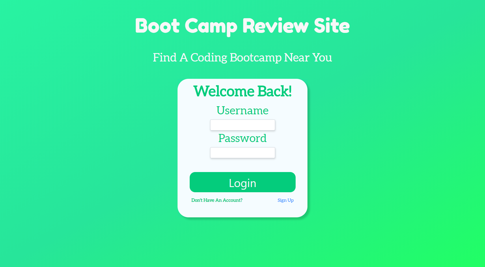
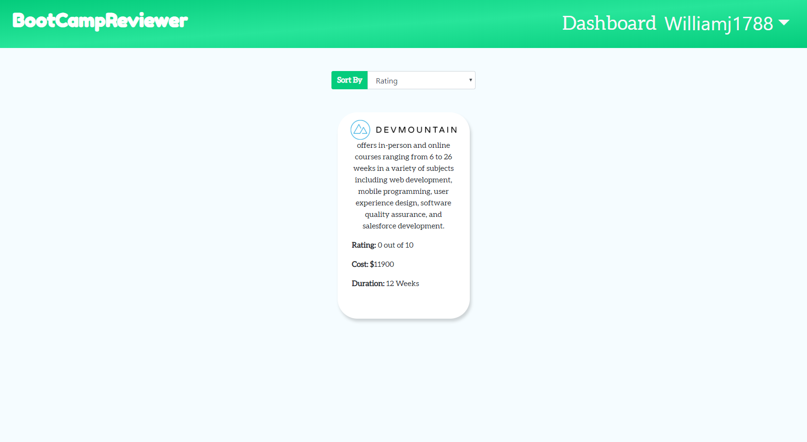
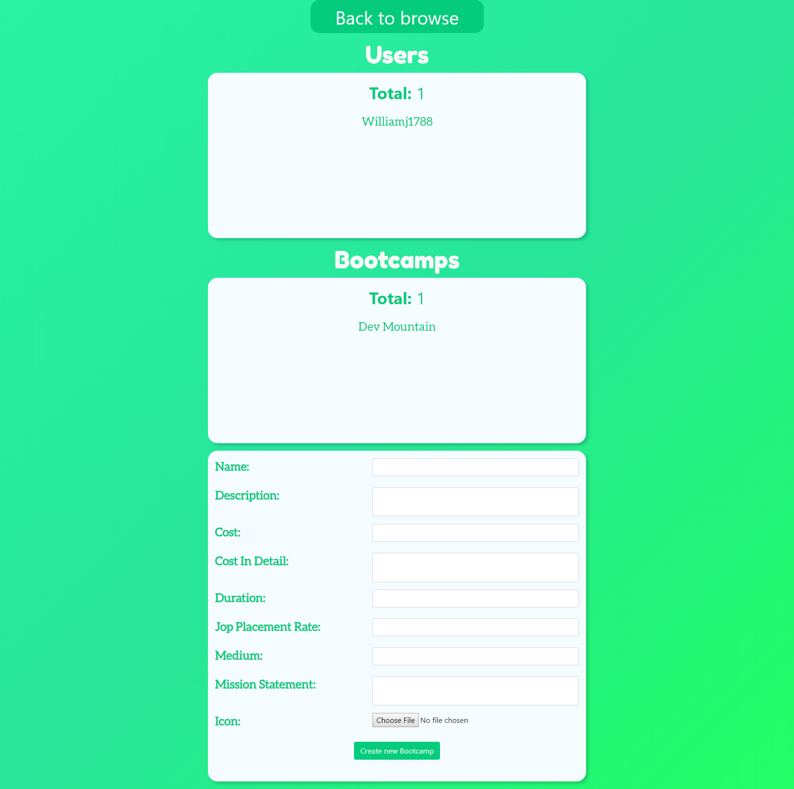

# BootCampReviewer

## Description

> This project allows you to view boot camps and to see what they can offer to their students. Users are allowed to leave reviews on boot camps.

## Timeline

> February 15, 2019 - February 23, 2019

## Technology

> * React
>   * react-router
>   * react-redux
> * SCSS
> * Node.js
> * Bootstrap

## What I learned

> * react-router
> * react-redux
> * Combining bootstrap with react
> * user authication
> * Using formData to sumbit form and using multi-party for parsing form

## How to install

If you want to view or edit this project, just follow these instructions

``` git
git clone https://github.com/williamj1788/BootCampReviewer
cd BootCampReviewer
npm install
npm run dev
```

The project should open in a new tab

If not it can be viewed on localhost 3000

## Pages

### Login/Signup



### Browse



### Dashboard

